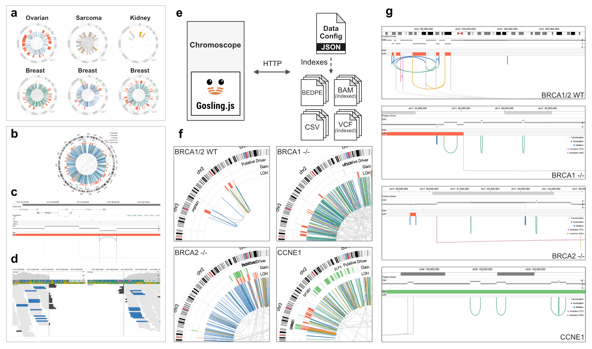

# Introduction

Welcome to the documentation of Chromoscope!

Chromoscope is an interactive visualization tool that supports multiscale and multiform visualizations for analyzing structural variants (SVs). Chromoscope enables users to analyze SVs at multiple scales using four main views (multiscale) (Fig. 1a–d). Moreover, each view uses different visual representations (multiform) that can facilitate the interpretation for a given level of scale.

||
|---|
|**Figure.** The Chromoscope interface consists of four views for analyzing structural variation in cancer genomes at multiple scales (a–d). Chromoscope uses a "data config" to load datasets via HTTP requests and does not require setting up a server (e). The data can be either stored privately or publicly (e.g., cloud buckets or local servers). Chromoscope captures distinct patterns of structural variations and their copy number footprint in samples with different types of chromosomal instability, such as chromothripsis, or associated with loss of BRCA1 -/-, BRCA2 -/-, or CCNE1 amplification (f-g).|