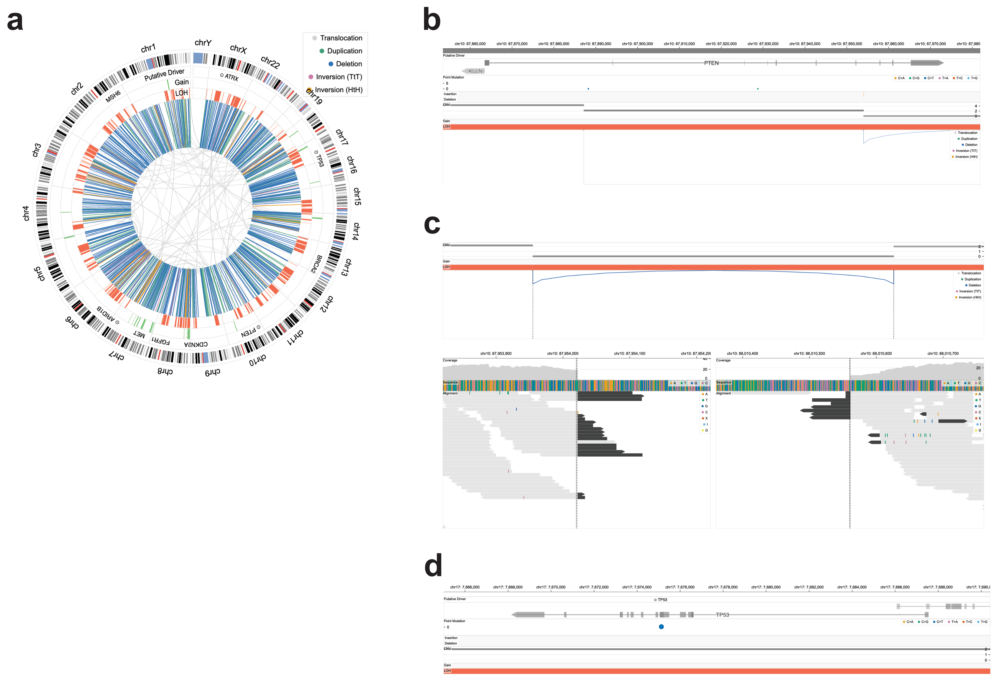

# Mutations Causing a Biallelic Loss of a Tumor suppressor

Chromoscope facilitates the interpretation of clinically-relevant SVs in cancer genomes. 

Known cancer genes are highlighted in the genome view for context (Fig. 1a), and, if desired, the user can navigate first to alterations near cancer-associated genes for detailed inspection.

The variant view shows the allele-specific copy number profile along with the SVs and mutations, allowing the user to identify co-localized loss-of-function point mutations and larger copy number variants, e.g., bi-allelic loss of tumor suppressor genes (Fig. 1d), which is associated with response to some oncological therapies [^1].

[^1]: Abida, W. et al. Rucaparib in Men With Metastatic Castration-Resistant Prostate Cancer Harboring a BRCA1 or BRCA2 Gene Alteration. J. Clin. Oncol. 38, 3763–3772 (2020).

Additionally, when bi-allelic loss is caused by a homozygous deletion, Chromoscope provides the read-level information in the breakpoint view for visual validation of the SV call (Fig. 1c) and the resulting complete loss of the tumor suppressor in cancer cells. 

||
|---|
|**Figure 1.** Clinical interpretation of cancer genomes. a. This cancer genome displays hundreds of duplications, deletions, and many loss-of-heterozygosity (LOH) segments, typical homologous recombination deficiency caused by BRCA1/2 loss. This pattern is frequent among triple-negative breast cancers [[link](https://chromoscope.bio/?demoIndex=1&domain=-73494565.89306358-322450988.89306355&external=https://somatic-browser-test.s3.amazonaws.com/configs/cell.line.benchmark.json)]. b. Structural variants in PTEN. One of the structural variants transects PTEN, a tumor suppressor gene. Together with concurrent LOH, this SV causes a bi-allelic loss of the tumor suppressor. The stepwise pattern of losses in the copy number profile is adjacent to structural variants: a deletion and a translocation [[link](https://chromoscope.bio/?demoIndex=1&domain=1762737066.000084-1762865558.9999166&external=https://somatic-browser-test.s3.amazonaws.com/configs/cell.line.benchmark.json)]. c. Split & Spanning Reads. The structural variants deleting PTEN have strong support from sequencing reads. The structural variant is supported by split (black) reads. Additionally, the last three exons of PTEN receive hardly any sequencing coverage, adding to the credibility of the homozygous deletion calls [[link](https://chromoscope.bio/?demoIndex=1&domain=1762823513.750124-1762908325.249876&external=https://somatic-browser-test.s3.amazonaws.com/configs/cell.line.benchmark.json)]. d. TP53, a tumor suppressor gene, was inactivated through bi-allelic loss. One hit comes from a point mutation, while the other allele was lost through a chromosome-wide deletion, resulting in loss-of-heterozygosity (LOH) of the region [[link](https://chromoscope.bio/?demoIndex=0&domain=2498442611.1246943-2498473284.2567544&external=https://somatic-browser-test.s3.amazonaws.com/configs/cell.line.benchmark.json)]. |