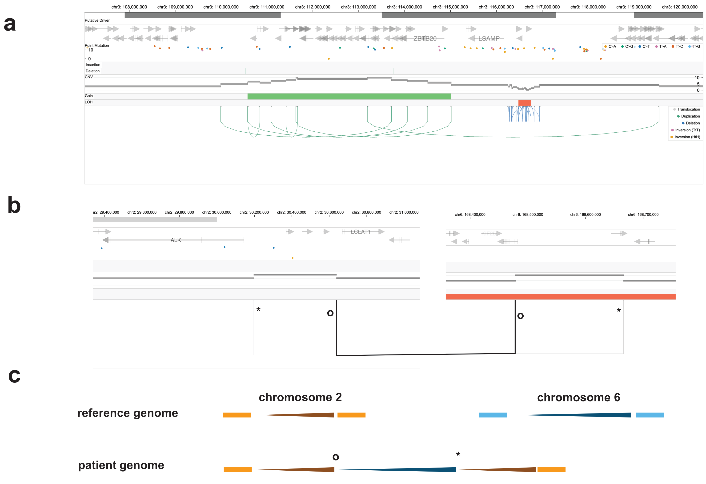
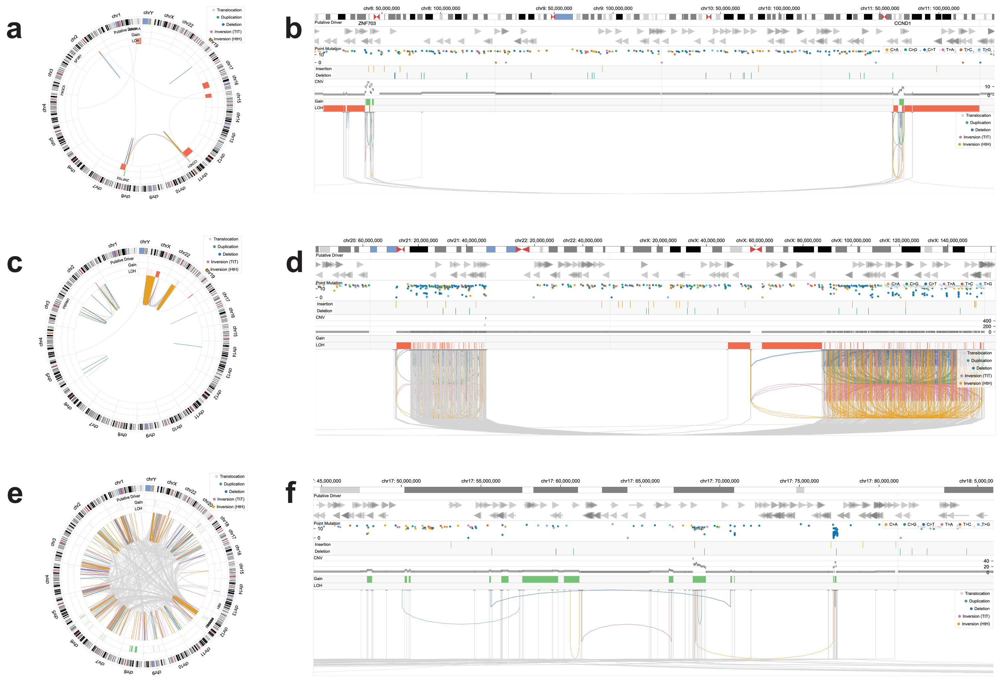

# A Global Pattern of Rearrangement Signatures

Genome-wide occurrences of specific structural variants (SVs) may indicate possible DNA repair deficiencies in cancer. For example, inactivation of a homologous recombination gene, such as BRCA1 and BRCA2, leads to chromosomal instability, thereby increasing the likelihood of therapeutic response to PARP inhibition[^1].

[^1]: Davies, H. et al. HRDetect is a predictor of BRCA1 and BRCA2 deficiency based on mutational signatures. Nat. Med. 23, 517–525 (2017).

||
|---|
|**Figure 1.** Chromoscope captures distinct patterns of structural variations and their copy number footprint in samples with different types of chromosomal instability, such as chromothripsis, or associated with loss of BRCA1 -/-, BRCA2 -/-, or CCNE1 amplification. |

In Chromoscope, the genomic signature is apparent as hundreds of scattered deletions and duplications with sizes of 1–10 kb are shown in the genome and variant views (Fig. 1).

||
|---|
|**Figure 2.** Complex structural variants in cancer genomes with bi-allelic CDK12 loss. a. 'Pyrgo' (i.e., a step-wise pattern of tandem duplications, represented by the green lines on the left) and a 'rigma' (i.e., a focal accumulation of deletions, shown as the blue lines on the right). These types of variants were described previously (Hadi, et al., Cell 2020). b. A 'synthetic duplication' spanning two chromosomes. This event is composed of two-semi-balanced translocations, with breakpoints for one translocation marked with asterisks (*) and circles (o) for the second translocation highlighted in black. c. Reconstruction of resulting chromosomes for the event in panel b. |

In the variant view, the footprint on the copy number profiles is consistent with losses and gains caused by deletions and tandem duplications. Recently, distinct somatic mutational signatures have been identified for tumors with CCNE1 amplifications and CDK12 mutations[^2], with characteristic complex rearrangements conspicuous in Chromoscope (Fig. 1 and 2).

[^2]: Shale, C. et al. Unscrambling cancer genomes via integrated analysis of structural variation and copy number. Cell Genomics 100112 (2022).

||
|---|
|**Figure 3.** Diverse complex structural variants visualized by Chromoscope in three cancer genomes. a-b. An amplification spanning two chromosomes, with multiple inter-chromosomal translocations and adjacent stretches of LOH. c-d. A chromothripsis event spanning two chromosomes, extreme amplifications with abundant kataegis. e-f. A chromoplexy event with the dominance of balanced translocations and kataegis at breakpoints, and resulting gene amplifications. |

Chromoscope also delineates other patterns of rearrangements including chromothripsis, chromoplexy, and multi-chromosomal amplifications (Fig. 3). Chromoscope's multiscale design allowed the user to analyze both genome-wide and local manifestations of SV patterns.