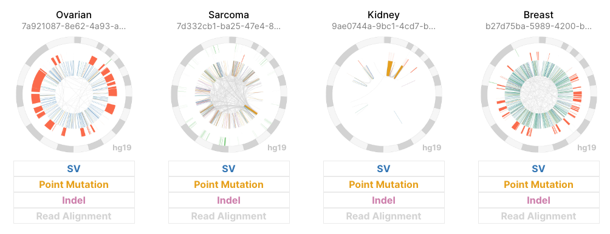

# Cohort View

This cohort-level view displays structural variants as arches connecting chromosomal breakpoints using distinct colors to indicate duplications, deletions, inversions, and inter-chromosomal translocations. This view also displays copy number variants (CNV) and loss of heterozygosity (LOH).

||
|---|
|__Figure.__ The visual summary of individual samples in the corhot view.|

With this cohort overview, you can quickly inspect the patterns of many structural variation samples and efficiently find samples of interest.

:::info
The four items listed on the bottom of each circular visualization (SV, Point Mutation, Indel, Read Alignment) denote whether the given sample contains the corresponding files.
:::

## Interactions

- You can click on a sample in this view to analyze them using three visualizations which are in the following sections.
- You can also browse [PCAWG Data](./public-data-config?id=pcawg-data) or [load a small number of your datasets](/data-config?id=loading-data-through-interface).

:::tip
You can find this view by clicking on a "≡" button shown on the top-left corner of the browser.
:::